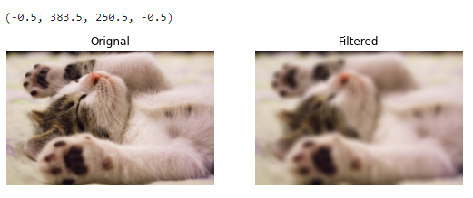
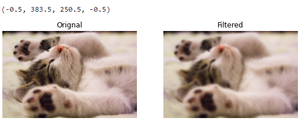
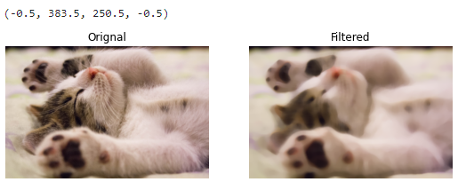
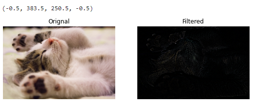
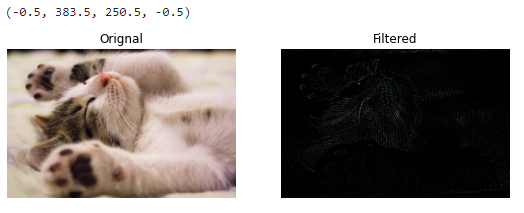

# Implementation-of-Filters
## Aim:
To implement filters for smoothing and sharpening the images in the spatial domain.

## Software Required:
Anaconda - Python 3.7

## Algorithm:
### Step1
Import cv2, matplotlib.py libraries and read the saved images using cv2.imread().

### Step2
Convert the saved BGR image to RGB using cvtColor().

### Step3
By using the following filters for image smoothing:filter2D(src, ddepth, kernel), Box filter,Weighted Average filter,GaussianBlur(src, ksize, sigmaX[, dst[, sigmaY[, borderType]]]), medianBlur(src, ksize),and for image sharpening:Laplacian Kernel,Laplacian Operator.

## Step4
Apply the filters using cv2.filter2D() for each respective filters.

### Step5
Plot the images of the original one and the filtered one using plt.figure() and cv2.imshow().

## Program:
### Developed By   :
### Register Number:
</br>

### 1. Smoothing Filters

i) Using Averaging Filter
```Python
import cv2
import numpy as np
import matplotlib.pyplot as plt
image1=cv2.imread('kitten.png') 
image2=cv2.cvtColor(image1, cv2.COLOR_BGR2RGB)
kernel=np.ones ((11,11),np. float32)/121 
image3=cv2.filter2D(image2,-1,kernel)
plt.figure(figsize=(9,9))
plt.subplot(1,2,1) 
plt.imshow(image2)
plt.title('Orignal')
plt.axis('off')
plt.subplot(1,2,2)
plt.imshow(image3)
plt.title('Filtered')
plt.axis("off")


```
ii) Using Weighted Averaging Filter
```Python
# Weighted Averaging Filter
import cv2 
import numpy as np
import matplotlib.pyplot as plt
image1 = cv2.imread('kitten.png')
kerne1 = np.array([[1,2,1],[2,4,2],[1,2,1]])/16
image2 = cv2.cvtColor(image1,cv2.COLOR_BGR2RGB)
image3 = cv2.filter2D(image2,-1,kernel)
plt.figure(figsize = (9,9))
plt.subplot(1,2,1)
plt.imshow(image2)
plt.title('Orignal')
plt.axis('off') 
plt.subplot(1,2,2)
plt.imshow(image3) 
plt.title('Filtered')
plt.axis('off')


```
iii) Using Gaussian Filter
```Python
# Gaussian Blurring
import cv2 
import numpy as np
import matplotlib.pyplot as plt
image1 = cv2.imread('kitten.png')
image2=cv2.cvtColor(image1, cv2.COLOR_BGR2RGB)
gaussian_blur=cv2.GaussianBlur(src=image2,ksize=(11,11),sigmaX=0,sigmaY=0)
plt.figure(figsize = (9,9))
plt.subplot(1,2,1)
plt.imshow(image2)
plt.title('Orignal')
plt.axis('off') 
plt.subplot(1,2,2)
plt.imshow(gaussian_blur) 
plt.title('Filtered')
plt.axis('off')


```

iv) Using Median Filter
```Python
# Median Blurring
import cv2 
import numpy as np
import matplotlib.pyplot as plt
image1 = cv2.imread('kitten.png')
image2 = cv2.cvtColor(image1,cv2.COLOR_BGR2RGB)
median_blur=cv2.medianBlur(src=image2,ksize=11)
plt.figure(figsize = (9,9))
plt.subplot(1,2,1)
plt.imshow(image2)
plt.title('Orignal')
plt.axis('off') 
plt.subplot(1,2,2)
plt.imshow(median_blur) 
plt.title('Filtered')
plt.axis('off')


```

### 2. Sharpening Filters
i) Using Laplacian Kernal
```Python
# Laplacian Kernel
import cv2 
import numpy as np
import matplotlib.pyplot as plt
image1 = cv2.imread('kitten.png')
kernel3 = np.array([[0,1,0],[1,-4,1],[0,1,0]])
image2 = cv2.cvtColor(image1,cv2.COLOR_BGR2RGB)
image3 = cv2.filter2D(image2,-1,kernel3)
plt.figure(figsize = (9,9))
plt.subplot(1,2,1)
plt.imshow(image2)
plt.title('Orignal')
plt.axis('off') 
plt.subplot(1,2,2)
plt.imshow(image3) 
plt.title('Filtered')
plt.axis('off')


```
ii) Using Laplacian Operator
```Python
# Laplacian Operator
import cv2 
import numpy as np
import matplotlib.pyplot as plt
image1 = cv2.imread('kitten.png')
image2 = cv2.cvtColor(image1,cv2.COLOR_BGR2RGB)
new_image = cv2.Laplacian(image2,cv2.CV_64F)
plt.figure(figsize = (9,9))
plt.subplot(1,2,1)
plt.imshow(image2)
plt.title('Orignal')
plt.axis('off') 
plt.subplot(1,2,2)
plt.imshow(image3) 
plt.title('Filtered')
plt.axis('off')


```

## OUTPUT:
## 1. Smoothing Filters
</br>

### i) Using Averaging Filter


### ii) Using Weighted Averaging Filter


### iii) Using Weighted Averaging Filter


### iv) Using Median Filter


## 2. Sharpening Filters
</br>

### i) Using Laplacian Kernal


### ii) Using Laplacian Operator


## Result:
Thus the filters are designed for smoothing and sharpening the images in the spatial domain.
